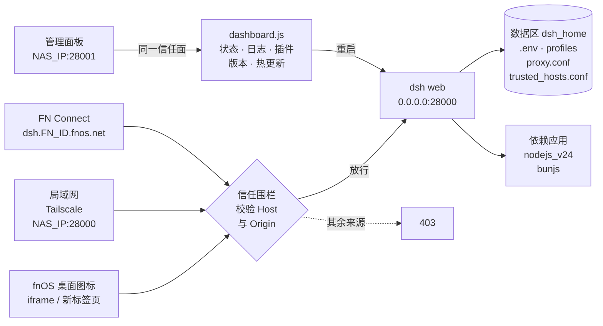

<div align="center">


# DeepSeek Harness for fnOS

**把 DeepSeek 官方 Agent 浏览器 UI（DeepSeek Harness / dsh）装成飞牛 fnOS 常驻应用：离线安装免联网，局域网与 FN Connect 直连，自带 28001 管理面板**

[](https://github.com/techysy/deepseek-harness-fnos/releases/latest)
[](https://github.com/techysy/deepseek-harness-fnos/releases)
[](#下载)
[](https://github.com/deepseek-ai/deepseek-harness)
[](https://nodejs.org/)
[](LICENSE)

[下载](#下载) · [功能](#功能) · [快速开始](#快速开始) · [访问方式](#访问方式) · [管理面板](#管理面板) · [配置](#配置) · [更新日志](CHANGELOG.md)

</div>

上游项目：[deepseek-ai/deepseek-harness](https://github.com/deepseek-ai/deepseek-harness)（DeepSeek Harness 开发者预览版，官网 <https://www.deepseek.com/harness/>）。本仓库不 fork 上游代码，只负责 fpk 打包、fnOS 生命周期脚本和少量运行时 / 构建期补丁；应用图标为 DeepSeek 官方黑色鲸鱼 logo。

## 下载

从 [**Releases**](https://github.com/techysy/deepseek-harness-fnos/releases/latest) 下载对应架构的 fpk：

| 架构 | 文件 | 说明 |
| --- | --- | --- |
| x86 | `dsh-<版本>-iframe-x86.fpk` | **推荐**：fnOS 桌面窗口内打开 |
| x86 | `dsh-<版本>-x86.fpk` | 桌面图标在浏览器新标签页打开 |
| ARM | `dsh-<版本>-iframe-arm.fpk` | **推荐**：fnOS 桌面窗口内打开 |
| ARM | `dsh-<版本>-arm.fpk` | 桌面图标在浏览器新标签页打开 |

> 版本号**跟随上游** `@deepseek-ai/dsh` 发行版（目前均为 `-rc` 预览版本，如 `0.1.7-rc.2`），本地修复不单独抬版本号。
> 全部为**离线包**（内置对应架构的 `node_modules`），安装时无需联网拉取 dsh；单个 fpk 约 120 MB。0.1.7 起 fpk 超过 Gitee 附件 100 MB 上限，**安装包只在 GitHub Release 提供**。
> 依赖应用：安装时 fnOS 自动安装 **nodejs_v24** 与 **bunjs**（manifest `install_dep_apps`）。manifest 未声明最低 fnOS / 应用中心版本。
> ARM 版在 `manylinux_2_28` 容器中编译原生模块，要求系统 glibc ≥ 2.28（fnOS ARM 设备为 Debian 12 / glibc 2.36）。

## 架构



## 功能

**离线自托管**
- **安装免联网**：`@deepseek-ai/dsh` 连同 `node_modules` 随 fpk 内置；只有离线包缺失时才回退到在线 `npm install`（单线程 + 512 MB 堆，照顾 1 GB 内存的小设备）
- **双架构**：x86 与 ARM 各出 iframe / url 两个变体，均由 GitHub Actions 在线打包
- **常驻服务**：以应用专属账号 `dsh` 运行（`run-as: package`），由 `cmd/main` 管理 start / stop / status / restart

**访问与安全**
- **局域网直连**：通过 `cordis.patch.yml` 把 dsh web 绑定到 `0.0.0.0:28000`（dsh CLI 本身拒绝 `--host 0.0.0.0`）
- **信任围栏**：`/api/*` 校验 Host / Origin，只放行回环地址 + `--trusted-host` 列表（启动时自动探测的本机 IP + `fnos.net` + `trusted_hosts.conf` 中的域名），其余来源 403
- **桌面免 401**：上游 0.1.2 起的浏览器 token 鉴权对静态桌面入口不可用，运行时补丁对已通过围栏的请求放行（等效「围栏即认证」）
- **FN Connect / DDNS 远程访问**：安装向导或应用设置里填 FN ID / 自定义域名，自动写入信任域，远程访问不再 403
- **设置页 host 模式**：构建期补丁让非回环访问（局域网 IP、FN Connect 域名）也能读写服务端配置，插件 / 模型设置不再空白

**运维**
- **28001 管理面板**：服务状态、三路日志、插件启停 / 删除 / 安装、版本检查、一键重启 dsh、一键下载并热安装更新（见 [管理面板](#管理面板)）
- **启动自愈**：启动前把 `.credentials.yaml` / `.env` 修正为 600 权限、清理占用 28000 端口的残留进程、修正被 root 误建的 `.gitconfig` 权限
- **数据保留**：升级不动数据区，卸载脚本只清理日志与 pid，都不删除 `dsh_home`（工作空间、会话、API Key、代理与信任域配置）

**Agent 运行环境**
- dsh 的 Agent / bash 工具可直接使用 `node` / `npm` / `npx` / `pnpm` / `yarn` / `corepack` / `bun`（来自依赖应用，启动时自动加入 PATH；见 [Agent 环境命令](#agent-环境命令)）
- npm 全局安装与 corepack 缓存都指向数据区，不占系统盘

## 快速开始

### 安装

1. 从 [Releases](https://github.com/techysy/deepseek-harness-fnos/releases/latest) 下载对应架构的 fpk（推荐 `iframe` 变体），在 fnOS 应用中心选择**手动安装**
2. 安装向导（所有项都可留空，之后再配）：

   | 字段 | 说明 |
   | --- | --- |
   | DeepSeek API Key | `sk-` 开头，写入数据区 `dsh_home/.env` |
   | 代理 IP / 代理端口 | 两项都填才生效，拼成 `http://IP:端口` 写入 `proxy.conf`；访问 GitHub / 外部 API 超时再填 |
   | FN Connect ID | 只填 ID（如 `techysy`），自动生成 `<ID>.fnos.net`、`dsh.<ID>.fnos.net`、`fnos.net` 三个信任域 |
   | 自定义域名 | 用自己的域名做 DDNS 远程访问时填完整域名（不带 `https://`），追加到信任域 |

3. 在 fnOS 桌面打开 **DeepSeek Harness** 图标进入 UI；或浏览器访问 `http://<NAS_IP>:28000`

### 升级

- **应用中心**：下载新版 fpk 后手动安装覆盖，数据区保留
- **管理面板一键更新**：`http://<NAS_IP>:28001/` →「一键下载到 NAS」→「安装更新」（需先做一次 sudo 授权，见 [管理面板](#管理面板)）

### 卸载

卸载前先停止 dsh 与网关代理，卸载后清理数据区的 `*.log` / `*.pid`；`dsh_home` 不会被卸载脚本删除，重装后数据仍在。

## 访问方式

| 入口 | 地址 | 说明 |
| --- | --- | --- |
| **fnOS 桌面图标** | 当前访问 fnOS 的主机名 + 端口 `28000` | iframe 变体在桌面窗口内打开，url 变体在新标签页打开；直连端口，不经网关 |
| **局域网 / Tailscale** | `http://<NAS_IP>:28000` | 本机所有非回环 IPv4 启动时自动加入信任列表 |
| **FN Connect** | `https://dsh.<FN_ID>.fnos.net` | 需在安装向导 / 应用设置中填写 FN ID；`https://<FN_ID>.fnos.net`、`https://fnos.net/<FN_ID>` 同样被信任 |
| **自定义域名（DDNS）** | `https://<你的域名>` | 需在安装向导 / 应用设置中填写自定义域名 |
| **管理面板** | `http://<NAS_IP>:28001/` | 与 dsh 相同的信任面 |

> fnOS 统一网关 `/app/dsh`（`app.sock` → `cmd/proxy.py` → `127.0.0.1:28000`）**未打通**：`proxy.py` 仍会随应用启动，但网关路由登录后返回 Not Found，请使用上表入口。调查过程见 [docs/dsh-access-and-gateway.md](docs/dsh-access-and-gateway.md)。

**安全机制**（0.1.7-rc.2 现状，补丁均为幂等，每次启动 / 安装时自动检查）：

| 机制 | 实现 | 说明 |
| --- | --- | --- |
| 0.0.0.0 绑定 | `cmd/main` 写 `dsh_home/profiles/web/cordis.patch.yml` | 覆盖 webserver 的 host / port |
| 信任围栏 | `cmd/main` 以单个 `--trusted-host` 传入全部信任值 | 该参数是 variadic，重复写 flag 只保留最后一个 |
| 桌面免 401 | `cmd/main` 内联补丁 `dsh-client-connection` 的 `isAuthenticated`（python3 不可用时用 node 兜底） | 结果写入 `app.log`；**请勿把 28000 / 28001 暴露到不受信任的网络** |
| 特权 API 放行 | 同上 | 上游 0.1.2 起已原生修复，补丁自动跳过 |
| 设置页 host 模式 | 构建期 `cmd/patch_settings_memory.py`，安装 / 升级时再补一次 | 非回环访问读写服务端配置 |

> 📖 围栏与回环限制详解：[docs/dsh-loopback-restriction.md](docs/dsh-loopback-restriction.md)

## 管理面板

0.1.5-rc.2 起内置独立管理面板（`cmd/dashboard.js`，零依赖纯 node），随 dsh 自动启动，浏览器打开 **`http://<NAS_IP>:28001/`**：

| 功能 | 说明 |
| --- | --- |
| **服务状态** | dsh web 进程 / 健康检查 / 运行时长、网关代理、fpk 与已装 dsh 版本、数据区路径 |
| **日志查看** | `app.log`（生命周期）/ `dsh.log`（dsh 输出）/ `dashboard.log`（面板），tail 尾部 + 5 秒自动刷新 |
| **插件管理** | 第三方插件**禁用 / 启用 / 删除 / 安装**（改 `profiles/web/package.json` 的 bundles，重启 dsh 生效）；插件不兼容导致 dsh 启动崩溃循环时可在此快速禁用 |
| **版本检查** | 上游版本优先取 GitHub `deepseek-ai/deepseek-harness` 的 Release Tag，取不到回退 npmmirror / npmjs；本项目最新 Release 优先 GitHub、Gitee 兜底 |
| **一键重启 dsh** | 经 `cmd/main restart` 执行，面板自身不受影响 |
| **📥 一键更新** | 从 GitHub 直链下载本机架构的 iframe 变体 fpk 到数据区 `dsh_home/update/`，再点「安装更新」经 `appcenter-cli install-fpk` 完成安装与重启 |
| **界面** | 日 / 夜主题切换、中英双语 |

- 信任面与 dsh 一致：本机 / 局域网 IP、`fnos.net` 及其子域、`trusted_hosts.conf` 自定义信任域可访问，其余来源 403
- 面板日志写入数据区 `dashboard.log`；`cmd/main stop` 不停面板，卸载时由 `uninstall_callback` 显式停止

**启用热更新**（一次性，SSH 到 NAS 执行）：

```bash
echo 'dsh ALL=(root) NOPASSWD: /usr/local/bin/appcenter-cli install-fpk /vol*/@appdata/dsh/dsh_home/update/*' | sudo tee /etc/sudoers.d/dsh-hotfix
sudo chmod 440 /etc/sudoers.d/dsh-hotfix
```

授权后「安装更新」按钮生效；不授权则按钮提示失败，可改用应用中心手动安装（已下载的 fpk 在数据区 `dsh_home/update/`）。

<details>
<summary><b>旧版本 fpk 加装管理面板</b></summary>

把仓库中的 `cmd/dashboard.js` 与最新 `cmd/main` 拷到 `/var/apps/dsh/cmd/`，重启 dsh 即可。从 Windows 拷贝时注意把 CRLF 转成 LF（否则报 `$'\r': command not found`）。

</details>

## 配置

### DeepSeek API Key

- 安装向导填写，或编辑数据区 `dsh_home/.env`：
  ```
  DEEPSEEK_API_KEY=sk-xxx
  ```
- 也可在 dsh 设置页内直接配置官方 / 自定义提供方的 API Key（改后重启应用生效）
- 应用设置页不含 API Key 字段；`.env` 权限每次启动自动修正为 600

### 网络代理（可选）

在安装向导或应用设置页填写代理 IP + 端口，写入 `dsh_home/proxy.conf`：

```
PROXY=http://127.0.0.1:7890
```

启动时据此设置 `HTTP_PROXY` / `HTTPS_PROXY` / `ALL_PROXY` 并写入 git 全局代理，dsh 的出站请求（git / npm / API）走该代理；没有 `proxy.conf` 或没有 `PROXY=` 行则不走代理。启动环境已带 `HTTP_PROXY` 时以环境变量为准；上游 0.1.2 起也遵循 `HTTP_PROXY` / `HTTPS_PROXY` / `ALL_PROXY` / `NO_PROXY`。

### 信任域（FN Connect / 自定义域名）

`dsh_home/trusted_hosts.conf`，每行一个主机名，`#` 开头为注释；`http(s)://` 前缀和结尾 `/` 会被自动去掉。可在安装向导或应用设置页修改：

- **FN Connect ID**：重写整个文件为 `<ID>.fnos.net`、`dsh.<ID>.fnos.net`、`fnos.net`
- **自定义域名**：追加一行

应用设置页的字段留空表示保留当前值；修改后重启应用生效。

### 端口与数据区

| 服务 | 端口 / 路径 | 说明 |
| --- | --- | --- |
| dsh web | `0.0.0.0:28000` | DeepSeek Harness 浏览器 UI（`TRIM_SERVICE_PORT` 可覆盖） |
| 管理面板 | `0.0.0.0:28001` | `dashboard.js` |
| 网关 socket | `/var/apps/dsh/target/app.sock` → `proxy.py` | 统一网关 `/app/dsh`，未打通（见 [访问方式](#访问方式)） |

数据区为 fnOS 注入的 `TRIM_PKGVAR`（通常是 `/vol<N>/@appdata/dsh`）：

| 路径 | 内容 |
| --- | --- |
| `app.log` · `dsh.log` · `proxy.log` · `dashboard.log` | 生命周期 / dsh / 网关代理 / 面板日志 |
| `install.log` · `config.log` | 安装与升级 / 应用设置回调日志 |
| `dsh-web-url.txt` | 最近一次启动时 dsh 打印的带 token 访问 URL（应急用） |
| `dsh_home/` | dsh 的 `HOME`：`.env`、`proxy.conf`、`trusted_hosts.conf`、`profiles/web/`（插件与 `cordis.patch.yml`）、`update/`（热更新下载）、`.npm-global` / `.npm` / `.corepack` |

## Agent 环境命令

安装后可在 dsh 的 Agent / bash 工具里直接使用以下命令（来自 fnOS 依赖应用，启动时自动加入 PATH）：

| 命令 | 来源 | 版本验证 | 数据落点 |
| --- | --- | --- | --- |
| `node` | nodejs_v24 依赖 | `node -v` | — |
| `npm` / `npx` | nodejs_v24 | `npm -v` | 全局安装 → 数据区 `dsh_home/.npm-global` |
| `pnpm` / `yarn` | corepack（nodejs_v24） | `pnpm --version` | corepack 缓存 → 数据区 `dsh_home/.corepack` |
| `bun` | bunjs 依赖 | `bun --version` | — |
| `corepack` | nodejs_v24 | `corepack --version` | — |

```bash
# 一键验证全部命令
node -v && npm -v && pnpm --version && yarn --version && bun --version
```

完整命令兼容矩阵与实测版本号见 [docs/dsh-nodejs-commands.md](docs/dsh-nodejs-commands.md)。

## 项目结构

```
deepseek-harness-fnos/
├── app/
│   ├── server/                  package.json 只声明 @deepseek-ai/dsh 版本；打包时 npm install 成离线 node_modules
│   └── ui/                      桌面入口配置 config（iframe / url）与图标
├── cmd/
│   ├── main                     start / stop / status / restart：运行时补丁、信任域、启动 dsh + proxy + 面板
│   ├── install_* · upgrade_*    安装 / 升级：写 .env / proxy.conf / trusted_hosts.conf、settings 补丁、离线包检查
│   ├── config_*                 应用设置页保存（代理 / FN ID / 自定义域名）
│   ├── uninstall_*              停止进程、清理日志与 pid
│   ├── dashboard.js             28001 管理面板
│   ├── proxy.py                 统一网关代理（app.sock → 127.0.0.1:28000）
│   └── patch_settings_memory.py 设置页 memory→host 补丁
├── config/                      privilege（run-as package）· resource（data-share 声明）
├── wizard/                      install（安装向导）· config（应用设置页）
├── scripts/                     离线打包、ARM node_modules 构建、补丁注入、401 热修、Release 通知、临时测试脚本
├── docs/                        打包 / 访问 / 回环限制 / Node 环境 / 上游同步文档，forum-templates/ 论坛发帖模板
├── release-0.1.7-rc.2/          该版本 Release 正文
├── .github/workflows/           build-fpk.yml（在线打包 + 上传 Release）· build-arm-node-modules.yml
├── manifest · VERSION           fpk 清单与版本号
├── ICON.PNG · ICON_256.PNG      应用图标
├── CHANGELOG.md · test log.md   更新日志 / 各版本测试报告
└── LICENSE
```

<details>
<summary><b>开发者：打包、补丁与发版</b></summary>

两条打包路径产出一致的 fpk（url 版 + iframe 版），详见 [docs/packaging-fpk.md](docs/packaging-fpk.md)。

**GitHub Actions 在线打包（推荐）**：`build-fpk.yml`，手动触发，每次一个架构

```bash
gh workflow run build-fpk.yml --ref main -f arch=x86     # 或 -f arch=arm（默认 arm）
gh run watch                                             # 产物: gh run download <run-id>
# 打包完成后直接上传到 Release（不存在则创建，同名资产覆盖）
gh workflow run build-fpk.yml -f arch=x86 -f release_tag=v0.1.7-rc.2
```

| 输入 | 说明 | 默认 |
| --- | --- | --- |
| `arch` | `arm` / `x86` | `arm` |
| `dsh_version` | 临时覆盖 `@deepseek-ai/dsh` 版本；留空用 `app/server/package.json` | 空 |
| `glibc_compat` | ARM 是否在 `manylinux_2_28` 容器内构建（仅 arm 生效） | `true` |
| `release_tag` | 打包后自动上传 fpk 到该 tag 的 Release；留空只产出 artifacts（保留 14 天） | 空 |

流程：校验 manifest 必需字段（`install_dep_apps` 含 nodejs_v24、`appname = dsh`、`version`）→ npm install → 注入 crypto.randomUUID polyfill 与 settings 补丁（未命中即失败）→ 下载 fnpack 1.2.1 → 删除 symlink（fnpack 不支持）→ 设置 `manifest.platform` → 打 url / iframe 两个 fpk。

**离线脚本**（NAS 本机；ARM 见 [docs/arm-build.md](docs/arm-build.md)）：

```bash
bash scripts/build-x86-offline.sh                                  # x86：url + iframe，交付到应用中心扫描目录
bash scripts/package-arm-offline.sh node_modules-arm64-<sha>.tar.gz  # ARM：用 build-arm-node-modules.yml 产出的 node_modules 打包
```

依赖 nodejs_v24、fnpack、python3。fnpack 1.2.4 拒绝 `-rc` 版本号，`build-x86-offline.sh` 检测到本机 fnpack 不是 1.2.1 时会临时下载 1.2.1 并放到 PATH 前部。

**版本号策略**：`manifest.version` 始终等于所打包的上游版本；本地补丁 / 修复不改版本号，同版本重新打包并记入 CHANGELOG 对应条目。

**本地补丁**（同步上游后必须逐项核对，见 [docs/upstream-sync-checklist.md](docs/upstream-sync-checklist.md)）：

| 补丁 | 位置 | 时机 |
| --- | --- | --- |
| crypto.randomUUID polyfill → `dsh-web-frontend/dist/index.html` | `scripts/inject_crypto_polyfill.py` | 构建期（上游前端已不引用，保留无害） |
| settings memory→host → `dsh-client-ui-settings(-models)/lib/client.js` | `cmd/patch_settings_memory.py` | 构建期 + 安装 / 升级 |
| 特权 API / 浏览器鉴权放行 → `dsh-client-connection/lib/index.js` | `cmd/main` 内联（独立版 `scripts/patch_privileged_fence.py`） | 每次启动 |

新增补丁时 `build-fpk.yml` 与 `build-x86-offline.sh` 两处都要加。改 host / 信任逻辑只动 `cmd/main`，无需重新打包。

**发版**

1. 更新 `app/server/package.json` 并 `npm install --package-lock-only` 同步 lock
2. 更新 `VERSION`、`manifest`（version / desc / changelog）、`CHANGELOG.md`
3. x86 与 arm 各触发一次 `build-fpk.yml` 并传同一个 `release_tag`；再用正式说明（如 `release-<版本>/notes.md`）替换自动生成的 Release 正文。Release 不勾选 prerelease，保证 `/releases/latest` 可用

**测试脚本**：`scripts/test_polyfill_header.js`、`scripts/test_lan_browser.py` 是针对特定环境的手工验证脚本（需已安装的 `node_modules` / 本地 Chrome 远程调试及写死的局域网 IP），不是自动化测试套件；各版本的装机测试记录在 [test log.md](test%20log.md)。

</details>

## 文档

- [fpk 打包指南](docs/packaging-fpk.md) — 在线 Actions / 离线脚本双路径、版本号策略、升级 SOP
- [同步上游后检查清单](docs/upstream-sync-checklist.md) — 每次同步上游 / 重装后验证本地补丁是否还在
- [访问与网关](docs/dsh-access-and-gateway.md) — 访问入口、统一网关 `/app/dsh` 不可行的调查
- [回环限制详解](docs/dsh-loopback-restriction.md) — 信任围栏 / trusted-host / settings host-mode
- [ARM 打包](docs/arm-build.md)
- [dsh Node.js 自托管](docs/dsh-nodejs.md) — node / npm 基础接入
- [dsh Agent 命令兼容矩阵](docs/dsh-nodejs-commands.md) — node / npm / npx / pnpm / yarn / bun / corepack 完整命令与数据区配置

## 已知限制

- 28000 / 28001 除信任围栏外没有登录鉴权（浏览器 token 鉴权已被补丁关闭），只适合局域网 / FN Connect 使用，请勿直接暴露到公网
- fnOS 统一网关 `/app/dsh` 未打通，请用 28000 直连、FN Connect 或自定义域名访问
- 上游仍是开发者预览版（`-rc`），本地补丁依赖上游代码的特定写法，上游改动后可能失效，需按检查清单核对
- 已发布的 `v0.1.7-rc.2` fpk 中，Web 侧边栏终端可能因服务账号登录 shell 为 `nologin` 而打开即退出（提示 `This account is currently not available.`）；修复已在 main 分支，下个版本生效，现在可手动执行 `sudo usermod -s /bin/bash dsh`
- 桌面打开出现 `dsh web authentication required` 401（启动补丁在个别环境没打上）时，SSH 到 NAS 执行热修脚本后在应用中心重启 dsh：
  ```bash
  curl -sL https://gitee.com/techysy/deepseek-harness-fnos/raw/main/scripts/fix-browser-auth-401.sh | sudo bash
  ```
- 面板「安装更新」需要一次性 sudo 授权；一键下载固定取 iframe 变体
- ARM 版与 x86 同一套打包流程，但作者未在 ARM 实机上做自动化测试；原生模块要求 glibc ≥ 2.28
- 离线包缺失而回退在线安装时，需要 nodejs_v24；如 node-pty 等原生模块需要重编译，还需 `sudo apt install -y build-essential`

## 许可证

[MIT](LICENSE)
